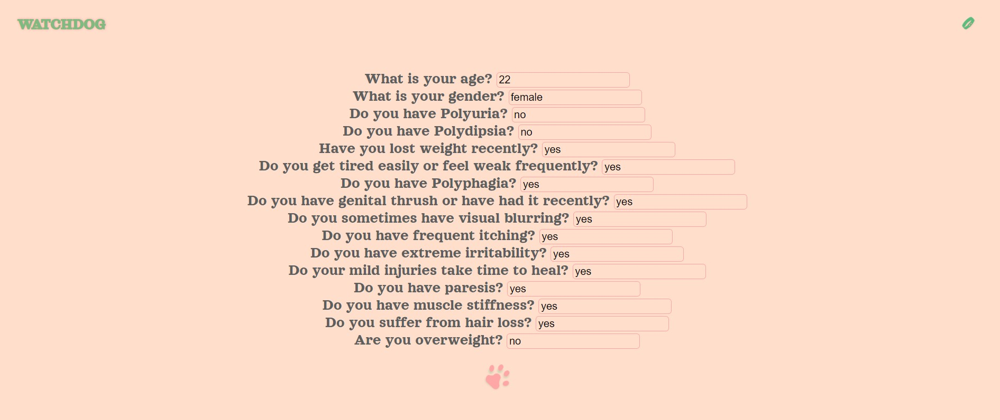

<!-- WatchDog is a web app that uses Machine Learning to predict if one has early stage Diabetes. The data used to train the classification model was sourced from the UCI Machine Learning Repository. You can view the application here: https://diabeteswatchdog.herokuapp.com/ -->

## [WATCHDOG](https://diabeteswatchdog.herokuapp.com/home) 

#### INTRODUCTION

***WATCHDOG*** is a web app that uses Machine Learning to predict if one has early stage Diabetes.

#### PURPOSE

This project is somewhat personal in nature; my grandmother who raised me for most of my childhood died from diabetes. Diabetes is one of mankind's slow and steady killers. Apart from its effects, it is also expensive to maintain. In the United States for example, in 2018, 10.5% of the total population had diabetes, which means that 34.5million of all people had diabetes in the United States in 2018.

A pertinent aspect of diabetes is that it can be spotted early and one can then make lifestyle changes to prevent it from getting worse. This is where ***WATCHDOG*** comes in, it can spot diabetes in both humans through a series of questions whose answers the model uses to perform a classification if one has symptoms of diabetes or not.

 

#### TOOLS

The site was built using Python and the Flask Framework. The model for predicting salaries was built on Google Colab whereby a yaml file was created, then added to the backend of the site. The form input captures the user's data, which is processed by the model and then a classification:

- [x] You have symptoms of Diabetes - for the positive class.
- [ ] You do not have symptoms of Diabetes - for the negative class. 

This classification result is then outputted back to the user.

#### DATA

The data used to train the Machine Learning model was gotten from UCI Repository. You can view the data [here](https://archive.ics.uci.edu/ml/datasets/Early+stage+diabetes+risk+prediction+dataset.).

#### CONTRIBUTIONS

At this present stage, ***WATCHDOG*** accepts closed submissions and contributions. If you are interested in contributing or funding the project, you can reach me on:
laresamdeola@gmail.com

#### LIVE SITE

You can visit ***WATCHDOG*** [here](https://diabeteswatchdog.herokuapp.com/home)
